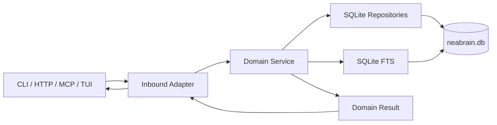

# Data Flow Diagram Spec

This diagram focuses on a create/search request path through the system.

## Mermaid

## Pencil MCP nodes
Nodes:
- Client (CLI / HTTP / MCP / TUI)
- Inbound Adapter
- Domain Service
- SQLite Repositories
- SQLite FTS
- neabrain.db
- Domain Result

Connections:
- Client -> Inbound Adapter -> Domain Service -> SQLite Repositories -> neabrain.db
- Domain Service -> SQLite FTS -> neabrain.db
- Domain Service -> Domain Result -> Inbound Adapter -> Client
