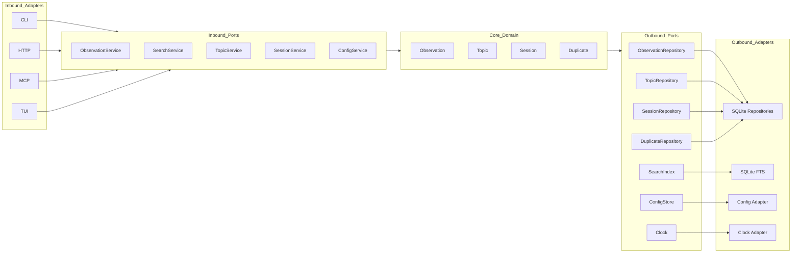

# Hexagonal Architecture Diagram Spec

This diagram describes the ports and adapters layout for NeaBrain.

## Mermaid

## Pencil MCP nodes
Nodes:
- Inbound adapters: CLI, HTTP, MCP, TUI
- Inbound ports: ObservationService, SearchService, TopicService, SessionService, ConfigService
- Core entities: Observation, Topic, Session, Duplicate
- Outbound ports: ObservationRepository, TopicRepository, SessionRepository, DuplicateRepository, SearchIndex, Clock, ConfigStore
- Outbound adapters: SQLite Repositories, SQLite FTS, Config Adapter, Clock Adapter

Connections:
- Inbound adapters -> inbound ports -> core entities -> outbound ports -> outbound adapters
